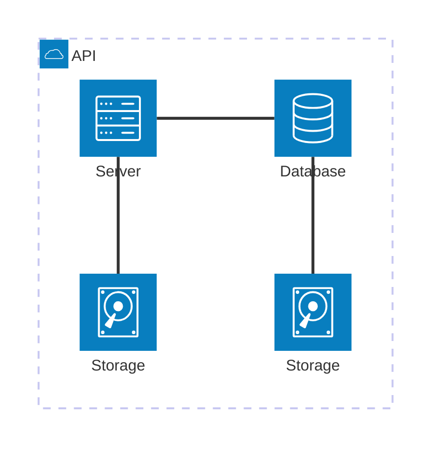

## Objetivo

Aqui vai o objetivo macro do roteiro. Por que estamos fazendo o que estamos fazendo?

=== "Code"

    ``` python
        import pandas as pd
        # Preprocess the data
        def preprocess(df):
            # Fill missing values
            df['Age'].fillnan(df['Age'].median(), inplace=True)
            df['Sex'].fillnan(df['Sex'].mode()[0], inplace=True)
            df['BP'].fillnan(df['BP'].median(), inplace=True)
            df['Na_to_K'].fillnan(df['Na_to_K'].median(), inplace=True)
            df['Drug'].fillnan(df['Drug'].median(), inplace=True)

            # Select features
            features = ['Age', 'Sex', 'BP', 'Cholesterol', 'Na_to_K', 'Drug']
            return df[features]

        # Load the drugs dataset
        df = pd.read_csv('https://raw.githubusercontent.com/LuizPazdziora/LuizPazdziora/main/drug200.csv')
        df = df.sample()

        # Preprocessing
        df = preprocess(df)

        # Display the first few rows of the dataset
        print(df.to_markdown(index=False))
    ```
    
=== "Code resultado"

    ``` python  exec='on' html='0'
    import pandas as pd
    # Preprocess the data
    def preprocess(df):
        # Fill missing values
        df['Age'].fillna(df['Age'].median(), inplace=True)
        df['Sex'].fillna(df['Sex'].mode()[0], inplace=True)
        df['BP'].fillna(df['BP'].mode()[0], inplace=True)
        df['Na_to_K'].fillna(df['Na_to_K'].median(), inplace=True)
        df['Drug'].fillna(df['Drug'].mode()[0], inplace=True)

        # Select features
        features = ['Age', 'Sex', 'BP', 'Cholesterol', 'Na_to_K', 'Drug']
        return df[features]

    # Load the drugs dataset
    df = pd.read_csv('https://raw.githubusercontent.com/LuizPazdziora/LuizPazdziora/main/drug200.csv')
    df = df.sample()

    # Preprocessing
    df = preprocess(df)

    # Display the first few rows of the dataset
    print(df.to_markdown(index=False))
    ```
    

## Montagem do Roteiro

Os pontos "tarefas" são os passos que devem ser seguidos para a realização do roteiro. Eles devem ser claros e objetivos. Com evidências claras de que foram realizados.

### Tarefa 1

Instalando o MAAS:

<!-- termynal -->

``` bash
sudo snap install maas --channel=3.5/Stable
```


/// caption
Dashboard do MAAS
///

Conforme ilustrado acima, a tela inicial do MAAS apresenta um dashboard com informações sobre o estado atual dos servidores gerenciados. O dashboard é composto por diversos painéis, cada um exibindo informações sobre um aspecto específico do ambiente gerenciado. Os painéis podem ser configurados e personalizados de acordo com as necessidades do usuário.

### Tarefa 2

## App


### Tarefa 1

### Tarefa 2

Exemplo de diagrama



[Mermaid](https://mermaid.js.org/syntax/architecture.html){:target="_blank"}

## Questionário, Projeto ou Plano

Esse seção deve ser preenchida apenas se houver demanda do roteiro.

## Discussões

Quais as dificuldades encontradas? O que foi mais fácil? O que foi mais difícil?

## Conclusão

O que foi possível concluir com a realização do roteiro?
