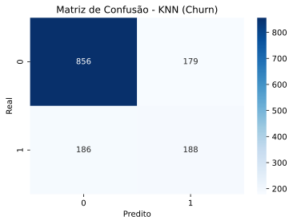

## Avaliação do Modelo KNN – Telco Customer Churn

- **Algoritmo:** K-Nearest Neighbors (KNN)  
- **Parâmetros principais:** `k = 5`, distância Euclidiana, dados padronizados (`StandardScaler`)  
- **Base:** Customer Churn (clientes de telecom)

### Desempenho global

- **Acurácia do modelo:** **0,74**  
  Isso significa que o modelo classifica corretamente cerca de **74%** dos clientes entre "churn" e "não churn".

### Desempenho por classe

**Classe 0 – Clientes que _não cancelaram_ (Churn = 0)**  
- **Precisão (precision):** 0,83  
- **Recall (sensibilidade):** 0,82  
- **F1-score:** 0,82  
- **Suporte:** 1035 clientes  

Interpretação:
- Quando o modelo prevê que o cliente **não vai cancelar**, ele acerta em torno de **83%** das vezes.
- Ele consegue recuperar **82%** de todos os clientes que realmente não cancelaram.
- O F1-score de **0,82** mostra um equilíbrio bom entre precisão e recall para essa classe.

---

**Classe 1 – Clientes que _cancelaram_ (Churn = 1)**  
- **Precisão (precision):** 0,50  
- **Recall (sensibilidade):** 0,51  
- **F1-score:** 0,51  
- **Suporte:** 374 clientes  

Interpretação:
- Quando o modelo prevê que o cliente **vai cancelar**, ele acerta em cerca de **50%** dos casos.
- Ele identifica aproximadamente **51%** de todos os clientes que realmente cancelam.
- O desempenho na classe de churn é bem mais fraco que na classe de não churn.

---

### Métricas agregadas

- **Macro average F1-score:** ~**0,67**  
  (média simples do F1 das duas classes; mostra desempenho médio entre elas).

- **Weighted average F1-score:** ~**0,74**  
  (média ponderada pelo suporte; fica próxima da acurácia porque a classe 0 é maioria).

### Conclusão

- O KNN com `k = 5` consegue um bom desempenho para a classe **não churn**, mas tem dificuldade maior em identificar corretamente os clientes que **cancelam**.
- Para o negócio, isso significa que:
  - O modelo é razoável para dizer quem **vai permanecer**,  
  - mas ainda perde muitos casos de **churn real**, que são justamente os mais importantes para ações de retenção.
- Próximos passos possíveis:
  - Balancear as classes (oversampling/undersampling),
  - Ajustar `k` e outros hiperparâmetros,
  - Testar outros modelos (Logistic Regression, Random Forest, XGBoost, etc.).


=== "Knn"

    ``` python exec="on" 
    --8<-- "docs/roteiro2/knn.py"
    ```


=== "Matriz de confusão"  


=== "pca-decision-boundary"  

