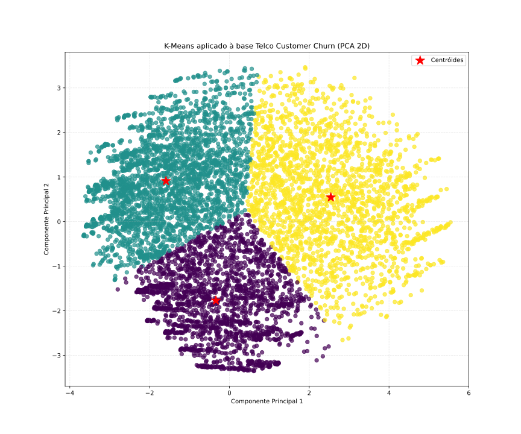

# K-Means aplicado à base Telco Customer Churn

## Objetivos

- Aplicar **K-Means** para agrupar clientes da base de churn.
- Entender a **intuição matemática** do algoritmo usando a base como exemplo.
- Explorar **perfis de clientes** através dos clusters.
- Analisar a **taxa de churn por cluster** para identificar grupos de maior risco.

A base utilizada já está **preprocessada** (valores faltantes tratados e variáveis categóricas codificadas).

---

## 1. Carregamento da base preprocessada

A base já passou por:

- remoção de `customerID`,
- tratamento de `TotalCharges`,
- imputação de valores faltantes,
- codificação das variáveis categóricas (LabelEncoder).

Neste notebook, apenas carregamos esse CSV preprocessado.

---

## 2. Visão geral dos dados

Nesta etapa analisamos:

- formato da base,
- tipos das variáveis,
- estatísticas descritivas numéricas,
- distribuição da variável-alvo **Churn**.

Essa análise inicial permite verificar se os dados estão coerentes antes da aplicação do modelo e entender o perfil geral da base.

---

## 3. Intuição do K-Means aplicada à base de churn

Cada cliente é representado por um vetor de características, como:

- `tenure` (tempo de contrato),
- `MonthlyCharges`, `TotalCharges`,
- serviços contratados (`InternetService`, `TechSupport`, etc., já codificados em números).

O **K-Means** tenta particionar os clientes em k grupos (clusters), minimizando a soma das distâncias quadradas entre cada cliente e o centróide do cluster ao qual ele pertence:

\[
J = \sum_{i=1}^{k} \sum_{x \in C_i} \lVert x - \mu_i \rVert^2
\]

onde:

- \( C_i \) = conjunto de clientes no cluster i,
- \( x \) = vetor de características do cliente,
- \( \mu_i \) = centróide (média dos vetores) do cluster i.

Na prática, isso significa que o algoritmo procura formar **grupos de clientes semelhantes** em termos de:

- perfil de consumo,
- tempo de permanência,
- tipo de serviço contratado, etc.

Após a criação dos clusters, cruzamos o resultado com a variável **Churn** para identificar **segmentos de maior risco de cancelamento**.

---

## 4. Preparação dos dados para o K-Means

Para aplicar o modelo:

1. Utilizamos apenas as features (removendo `Churn` da matriz de entrada).
2. Padronizamos as variáveis com **StandardScaler**, pois o algoritmo é sensível à escala.

Sem padronização, variáveis como `MonthlyCharges` dominariam a distância em relação a variáveis categóricas codificadas.

---

## 5. Escolha do número de clusters (k)

Não existe um valor único "correto" de k. Para decidir, utilizamos:

1. **Método do cotovelo (Elbow method)** – avalia a inércia (soma das distâncias internas).
2. **Silhouette score** – mede a separação entre clusters (quanto maior, melhor).

Testamos valores como:

k = 2, 3, ..., 8

### Escolha de k

Com base nos gráficos de:

- **Inércia** (procuramos o "cotovelo"),
- **Silhouette score** (quanto maior, melhor a separação),

escolhemos um valor que equilibrasse:

- complexidade do modelo,
- qualidade dos grupos.

Para este estudo, consideramos:

**k = 3**

(Ajuste este valor se seus gráficos indicarem outro resultado.)

---

## 6. Análise dos clusters: taxa de churn por grupo

Agora que cada cliente pertence a um cluster, analisamos:

- número de clientes por grupo,
- taxa média de churn por cluster.

Isso permite classificar clusters como **perfis de risco**.

### Interpretação dos clusters

Cada linha da tabela representa:

- `n_clientes`: quantidade de clientes no cluster
- `taxa_churn`: proporção de cancelamentos

Exemplo de leitura:

- Cluster 0: 500 clientes, churn = 0,15 → baixo risco
- Cluster 1: 300 clientes, churn = 0,40 → risco médio
- Cluster 2: 600 clientes, churn = 0,55 → alto risco

(Os valores exatos dependem da sua execução.)

---

## 7. Perfil médio de cada cluster

Calculamos a média das variáveis numéricas por cluster para entender melhor os grupos.

Isso permite identificar:

- clientes novos x antigos,
- clientes que gastam mais x menos,
- clientes

=== "pca-decision-boundary"  
